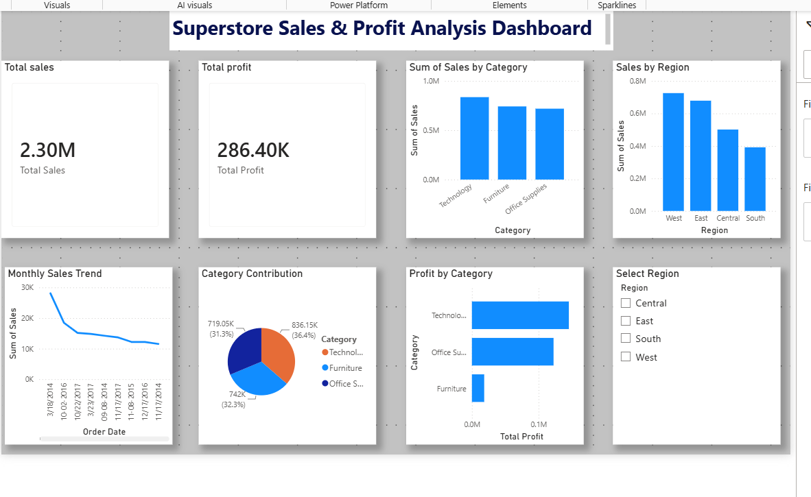
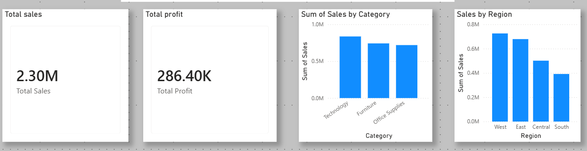
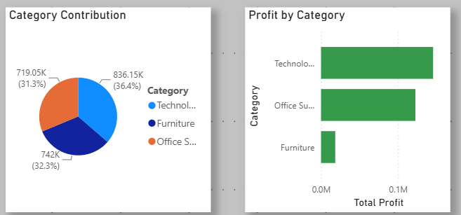

# Superstore-Sales-Analysis-PowerBI
Power BI dashboard project analyzing Superstore sales, profit, category, and regional performance using DAX and data visualization.
# Superstore Sales & Profit Analysis Dashboard | Power BI

## 📌 Project Overview

This project focuses on analyzing Superstore sales data using Microsoft Power BI to identify important business insights related to sales performance, profitability, categories, and regional trends.

An interactive dashboard was created using Power BI with data cleaning, DAX measures, and visualizations to understand business performance and support data-driven decision making.

---

## 🛠️ Tools & Technologies Used

- Microsoft Power BI
- Power Query
- DAX (Data Analysis Expressions)
- Excel / CSV Dataset

---

## 🎯 Project Objectives

- Analyze overall sales and profit performance
- Understand category-wise sales contribution
- Compare regional sales performance
- Identify profitable categories
- Analyze sales trends
- Build an interactive business dashboard

---

## 📊 Dashboard Features

### KPI Metrics
- Total Sales
- Total Profit

### Sales Analysis
- Sales by Category
- Sales by Region
- Monthly Sales Trend

### Profit Analysis
- Profit by Category
- Category contribution analysis

### Interactive Features
- Region slicer for dynamic filtering

---

## 📈 Key Insights

- Technology category generated the highest profit among all categories.
- Sales performance differs across regions.
- Category and regional analysis helps identify business performance patterns.

---

## 💡 Skills Demonstrated

- Data Analysis
- Data Visualization
- Power BI Dashboard Development
- DAX Measures
- Business Intelligence Reporting

---

## 📂 Project Files

- Power BI Dashboard (.pbix)
- Superstore Dataset (.csv)
- Dashboard Screenshots
## 📸 Dashboard Preview

### Sales Analysis

### Profit Analysis

---

## 👩‍💻 Author

Sri Harshini
